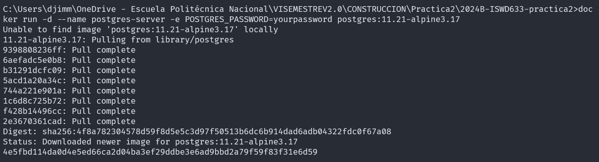

### Crear contenedor de Postgres sin que exponga los puertos. Usar la imagen: postgres:11.21-alpine3.17

### Crear un cliente de postgres. Usar la imagen: dpage/pgadmin4

La figura presenta el esquema creado en donde los puertos son:
a: (80)
b: (80)
c: (5432)

## Desde el cliente
### Acceder desde el cliente al servidor postgres creado.

### Crear la base de datos info, y dentro de esa base la tabla personas, con id (serial) y nombre (varchar), agregar un par de registros en la tabla, obligatorio incluir su nombre.

