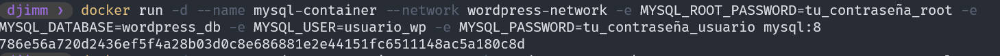

## Esquema para el ejercicio

### Crear la red

### Crear el contenedor mysql a partir de la imagen mysql:8, configurar las variables de entorno necesarias

### Crear el contenedor wordpress a partir de la imagen: wordpress, configurar las variables de entorno necesarias

De acuerdo con el trabajo realizado, en la el esquema de ejercicio el puerto a es **(completar con el valor)**

Ingresar desde el navegador al wordpress y finalizar la configuración de instalación.

Desde el panel de admin: cambiar el tema y crear una nueva publicación.
Ingresar a: http://localhost:9300/ 
recordar que a es el puerto que usó para el mapeo con wordpress
# COLOCAR UNA CAPTURA DEL SITO EN DONDE SEA VISIBLE LA PUBLICACIÓN.

### Eliminar el contenedor wordpress

### Crear nuevamente el contenedor wordpress
Ingresar a: http://localhost:9300/ 
recordar que a es el puerto que usó para el mapeo con wordpress

### ¿Qué ha sucedido, qué puede observar?
Cuando recreas el contenedor de WordPress, se pierde la configuración y las publicaciones que hiciste, ya que el contenedor se creó de nuevo desde cero sin ningún dato persistente. Esto significa que tendrás que volver a realizar la configuración inicial y crear las publicaciones nuevamente, a menos que estés utilizando un volumen para persistir los datos de WordPress.

